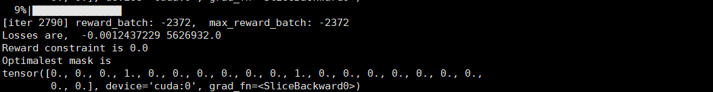

This project is adapted from [CAUSAL DISCOVERY WITH REINFORCEMENT
LEARNING] (https://github.com/huawei-noah/trustworthyAI/tree/master/research/Causal%20Discovery%20with%20RL)
which exploits actor-critic algorithm for the compositional optimization problem between discrete variables.
The initial setting is exploited to search the causal graph and we change this setting to search the hash function.

In concrete, AC_fs is the main function, which trains an agent to perturb the mask to get the highest reward.
The reward here is defined as the collide rate of the searched hash function on 50,000 function names crawled from
popular Java projects on Github.
In the reinforcement setting, the action for the actor is to perturb the current action, which is a 20-dimensional 01 vector 
representing whether we should choose the i-th character in the natural language hash string.
The dataset used is stored in method_name_5w.txt.

Install Pytorch
Run the following command to start training
```
python AC_fs.py
```
Then, you will see the log like this in the terminal

Finally, it would converge to a state as the goal.# reinforcement-learning-search-hash
